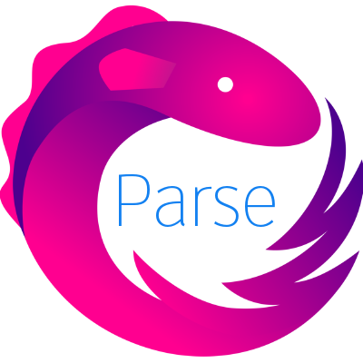
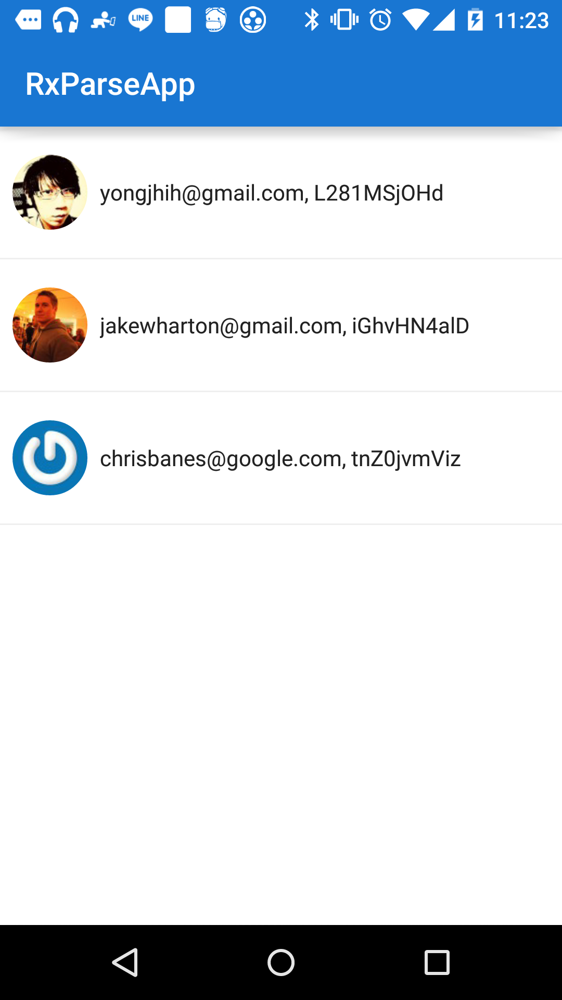

# RxParse

[](art/rxparse-transparent.png)

[](https://gitter.im/yongjhih/RxParse?utm_source=badge&utm_medium=badge&utm_campaign=pr-badge&utm_content=badge)

[ ](https://bintray.com/yongjhih/maven/RxParse/_latestVersion)
[](https://www.bountysource.com/teams/8tory/bounties?utm_source=8tory&utm_medium=shield&utm_campaign=bounties_posted)
[](https://travis-ci.org/yongjhih/RxParse)
[](http://android-arsenal.com/details/1/1670)

[](art/users.png)

## Usage

### find


`<T extends ParseObject> Observable<T> ParseObservable.find(ParseQuery<T>);`

Before:

```java
ParseUser.getQuery().findInBackground(new FindCallback() {
    @Override
    public done(ParseUser user, ParseException e) {
        if (e == null) System.out.println(user));
    }
});
```

After:

```java
Observable<ParseUser> users = ParseObservable.find(ParseUser.getQuery());
users.subscribe(user -> System.out.println(user.getObjectId()));
```

```java
Observable<ParseUser> users = ParseObservable.find(ParseUser.getQuery().setLimit(1000));
```

### count

Before:

```java
ParseUser.getQuery().countInBackground(new CountCallback() {
    @Override
    public done(int count, ParseException e) {
        if (e == null) System.out.println(count));
    }
});
```

After:

```java
Observable<Integer> count = ParseObservable.count(ParseUser.getQuery());
count.subscirbe(c -> System.out.println(c));
```

### loginWithFacebook

```java
Observable<ParseUser> loginUser = ParseObservable.loginWithFacebook(activity);
```

### fetchIfNeeded

Before:

```java
ParseUser.getQuery().fetchIfNeededInBackground(new GetCallback() {
    @Override
    public done(ParseUser user, ParseException e) {
        if (e == null) System.out.println(user));
    }
});
```

After:

```java
ParseObservable.fetchIfNeeded(user)
    .subscribe(user -> System.out.println(user));
```

```java
ParseObservable.fetchIfNeeded(users)
    .subscribe(users -> System.out.println(users));
```

```java
ParseObservable.find(ParseUser.getQuery()).toList().flatMap(users -> ParseObservable.fetchIfNeeded(users));
    .subscribe(users -> System.out.println(users));
```

### pin

Before:

```java
user.pinInBackground(new SaveCallback() {
    @Override
    public done(ParseException e) {
        // ...
    }
});
```

After:

```java
ParseObservable.pin(user)
    .subscribe(user -> System.out.println(user));
```

```java
ParseObservable.pin(name, user)
    .subscribe(user -> System.out.println(user));
```

### pin List

Before:

```java
ParseObject.pinAllInBackground(users, new SaveCallback() {
    @Override
    public done(ParseException e) {
        // ...
    }
});
```

After:

```java
ParseObservable.pin(users)
    .subscribe(user -> System.out.println(user));
```

```java
ParseObservable.pin(name, users)
    .subscribe(user -> System.out.println(user));
```

### Unpin

```java
ParseObservable.unpin(user)
    .subscribe(user -> System.out.println(user));
```

```java
ParseObservable.unpin(users)
    .subscribe(user -> System.out.println(user));
```

```java
ParseObservable.unpin(name, user)
    .subscribe(user -> System.out.println(user));
```

```java
ParseObservable.unpin(name, users)
    .subscribe(user -> System.out.println(user));
```

### save

Before:

```java
user.saveInBackground(new SaveCallback() {
    @Override
    public done(ParseException e) {
        // ...
    }
});
```

After:

```java
ParseObservable.save(user)
    .subscribe(user -> System.out.println(user));
```

## Installation

via jcenter

```gradle
repositories {
    jcenter()
}

dependencies {
    compile 'com.infstory:rxparse:1.0.2'
}
```

Or via jitpack.io

```gradle
repositories {
    maven {
        url "https://jitpack.io"
    }
}

dependencies {
    compile 'com.github.yongjhih:rxparse:1.0.2'
}
```

## LICENSE

Copyright 2015 8tory, Inc.

Licensed under the Apache License, Version 2.0 (the "License"); you may not use this file except in compliance with the License. You may obtain a copy of the License at

http://www.apache.org/licenses/LICENSE-2.0

Unless required by applicable law or agreed to in writing, software distributed under the License is distributed on an "AS IS" BASIS, WITHOUT WARRANTIES OR CONDITIONS OF ANY KIND, either express or implied. See the License for the specific language governing permissions and limitations under the License.
